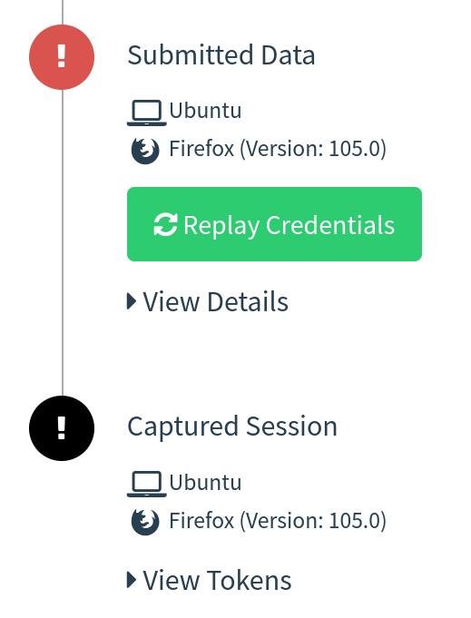
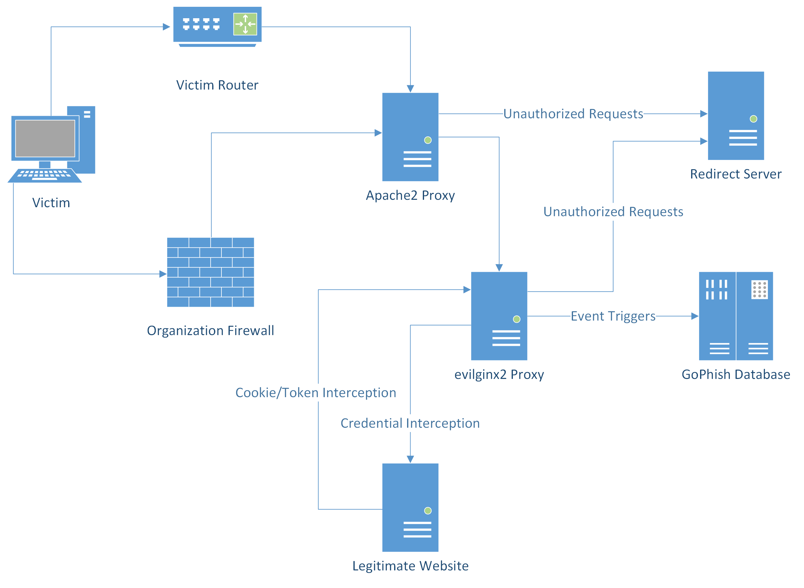
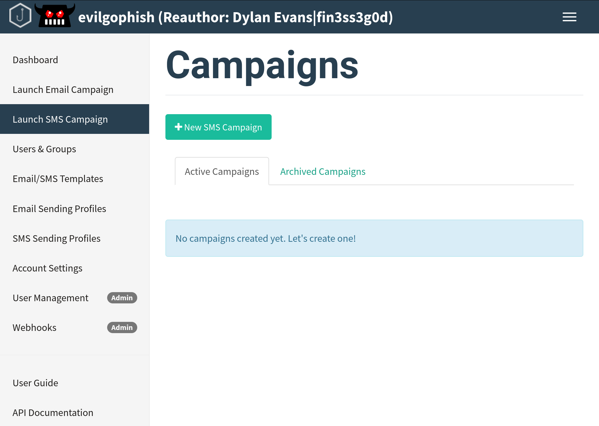
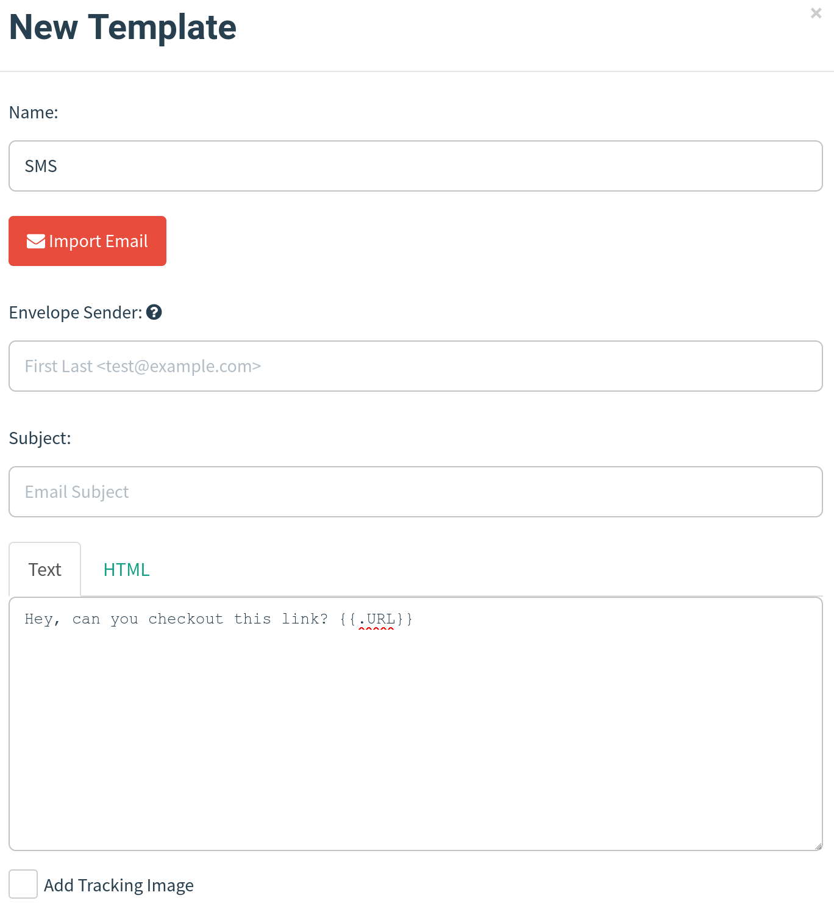
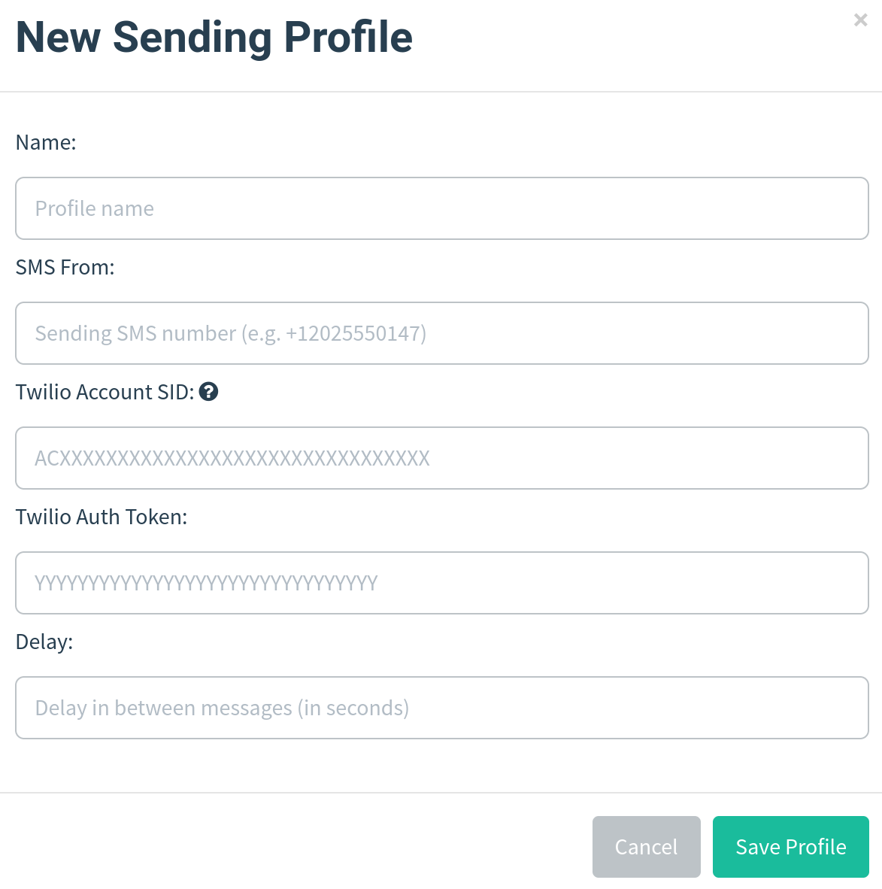
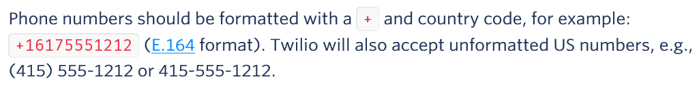
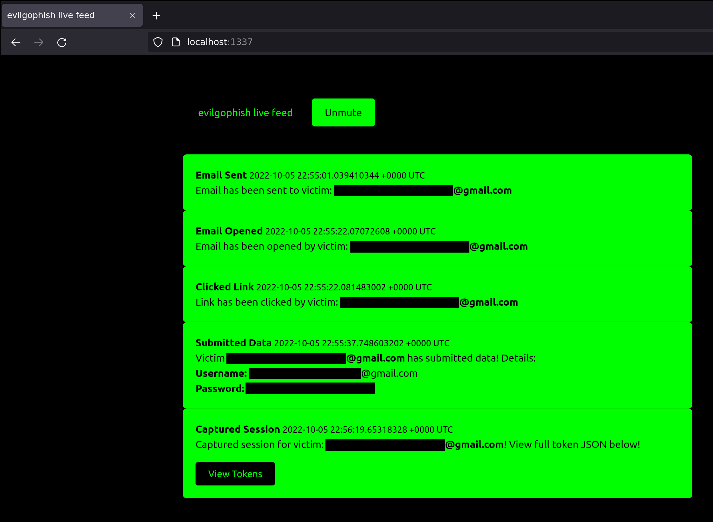

# Table of Contents

- [PhishlikePro](#PhishlikePro)
  * [Credits](#credits)
  * [Prerequisites](#prerequisites)
  * [Disclaimer](#disclaimer)
  * [Why?](#why)
  * [Background](#background)
  * [Infrastructure Layout](#infrastructure-layout)
  * [setup.sh](#setupsh)
  * [replace_rid.sh](#replace_ridsh)
  * [Email Campaign Setup](#email-campaign-setup)
  * [SMS Campaign Setup](#sms-campaign-setup)
  * [Live Feed Setup](#live-feed-setup)
  * [Phishlets Surprise](#phishlets-surprise)
  * [A Word About Phishlets](#a-word-about-phishlets)
  * [Debugging](#debugging)
  * [Apache2 Customiization](#apache2-customization)
  * [A Note About Campaign Testing And Tracking](#a-note-about-campaign-testing-and-tracking)
  * [A Note About The Blacklist and Tracking](#a-note-about-the-blacklist-and-tracking)
  * [Changes To evilginx2](#changes-to-evilginx2)
  * [Changes to GoPhish](#changes-to-gophish)
  * [Changelog](#changelog)
  * [Issues and Support](#issues-and-support)
  * [Future Goals](#future-goals)
  * [Contributing](#contributing)

# PhishlikePro
`Onion Web: `[PhishlikePro.onion](https://PhishlikePro.onion)
[PhishlikePro](https://github.com/akaraon8bit/phishlikepro.git)  is Combination of [evilgophish](https://github.com/fin3ss3g0d/evilgophish)  [evilginx2](https://github.com/kgretzky/evilginx2) and [GoPhish](https://github.com/gophish/gophish).

## Credits

Before I begin, I would like to say that I am in no way bashing [Kuba Gretzky](https://github.com/kgretzky) and his work. I thank him personally for releasing [evilginx2](https://github.com/kgretzky/evilginx2) to the public. In fact, without his work this work would not exist. I must also thank [Jordan Wright](https://github.com/jordan-wright) for developing/maintaining the incredible [GoPhish](https://github.com/gophish/gophish) toolkit.

## Prerequisites

You should have a fundamental understanding of how to use `GoPhish`, `evilginx2`, and `Apache2` all config are configured automatically on Centos 7 for now.

## Disclaimer

I shall not be responsible or liable for any misuse or illegitimate use of this software. This software is only to be used in authorized penetration testing or red team engagements where the operator(s) has(ve) been given explicit written permission to carry out social engineering.

## Why?

As a penetration tester or red teamer, you may have heard of `evilginx2` as a proxy man-in-the-middle framework capable of bypassing `two-factor/multi-factor authentication`. This is enticing to us to say the least, but when trying to use it for social engineering engagements, there are some issues off the bat. I will highlight the two main problems that have been addressed with this project, although some other bugs have been fixed in this version which I will highlight later.

1. Lack of tracking - `evilginx2` does not provide unique tracking statistics per victim (e.g. opened email, clicked link, etc.), this is problematic for clients who want/need/pay for these statistics when signing up for a social engineering engagement.
2. Session overwriting with NAT and proxying - `evilginx2` bases a lot of logic off of remote IP address and will whitelist an IP for 10 minutes after the victim triggers a lure path. `evilginx2` will then skip creating a new session for the IP address if it triggers the lure path again (if still in the 10 minute window). This presents issues for us if our victims are behind a firewall all sharing the same public IP address, as the same session within `evilginx2` will continue to overwrite with multiple victim's data, leading to missed and lost data. This also presents an issue for our proxy setup, since `localhost` is the only IP address requesting `evilginx2`.

## Background

In this setup, `GoPhish` is used to send emails and provide a dashboard for `evilginx2` campaign statistics, but it is not used for any landing pages. Your phishing links sent from `GoPhish` will point to an `evilginx2` lure path and `evilginx2` will be used for landing pages. This provides the ability to still bypass `2FA/MFA` with `evilginx2`, without losing those precious stats. `Apache2` is simply used as a proxy to the local `evilginx2` server and an additional hardening layer for your phishing infrastructure. Realtime campaign event notifications have been provided with a local websocket/http server I have developed and full usable `JSON` strings containing tokens/cookies from `evilginx2` are displayed directly in the `GoPhish` GUI (and feed):



## Infrastructure Layout



- `evilginx2` will listen locally on port `8443`
- `GoPhish` will listen locally on port `8080` and `3333`
- `Apache2` will listen on port `443` externally and proxy to local `evilginx2` server
  - Requests will be filtered at `Apache2` layer based on redirect rules and IP blacklist configuration
    - Redirect functionality for unauthorized requests is still baked into `evilginx2` if a request hits the `evilginx2` server

## setup.sh

`setup.sh` has been provided to automate the needed configurations for you. Once this script is run and you've fed it the right values, you should be ready to get started. Below is the setup help (note that certificate setup is based on `letsencrypt` filenames):

```
Usage:
./run <root domain> <subdomain(s)> <root domain bool> <redirect url> <feed bool> <rid replacement> <blacklist bool>
 - root domain                     - the root domain to be used for the campaign
 - subdomains                      - a space separated list of evilginx2 subdomains, can be one if only one
 - root domain bool                - true or false to proxy root domain to evilginx2
 - redirect url                    - URL to redirect unauthorized Apache requests
 - feed bool                       - true or false if you plan to use the live feed
 - rid replacement                 - replace the gophish default "rid" in phishing URLs with this value
 - blacklist bool                  - true or false to use Apache blacklist
Example:
  ./setup.sh example.com "accounts myaccount" false https://redirect.com/ true user_id false
```

Redirect rules have been included to keep unwanted visitors from visiting the phishing server as well as an IP blacklist. The blacklist contains IP addresses/blocks owned by ProofPoint, Microsoft, TrendMicro, etc. Redirect rules will redirect known *"bad"* remote hostnames as well as User-Agent strings.

## replace_rid.sh

In case you ran `setup.sh` once and already replaced the default `RId` value throughout the project, `replace_rid.sh` was created to replace the `RId` value again.

```
Usage:
./replace_rid <previous rid> <new rid>
 - previous rid      - the previous rid value that was replaced
 - new rid           - the new rid value to replace the previous
Example:
  ./replace_rid.sh user_id client_id
```

## Email Campaign Setup

Once `setup.sh` is run, the next steps are:

1. Start `GoPhish` and configure email template, email sending profile, and groups
2. Start `evilginx2` and configure phishlet and lure (must specify full path to `GoPhish` `sqlite3` database with `-g` flag)
3. Ensure `Apache2` server is started
4. Launch campaign from `GoPhish` and make the landing URL your lure path for `evilginx2` phishlet
5. **PROFIT**

## SMS Campaign Setup

An entire reworking of `GoPhish` was performed in order to provide `SMS` campaign support with `Twilio`. Your new `PhishlikePro` dashboard will look like below:



Once you have run `setup.sh`, the next steps are:

1. Configure `SMS` message template. You will use `Text` only when creating a `SMS` message template, and you should not include a tracking link as it will appear in the `SMS` message. Leave `Envelope Sender` and `Subject` blank like below:



2. Configure `SMS Sending Profile`. Enter your phone number from `Twilio`, `Account SID`, `Auth Token`, and delay in between messages into the `SMS Sending Profiles` page:



3. Import groups. The `CSV` template values have been kept the same for compatibility, so keep the `CSV` column names the same and place your target phone numbers into the `Email` column. Note that `Twilio` accepts the following phone number formats, so they must be in one of these three:



4. Start `evilginx2` and configure phishlet and lure (must specify full path to `GoPhish` `sqlite3` database with `-g` flag)
5. Ensure `Apache2` server is started
6. Launch campaign from `GoPhish` and make the landing URL your lure path for `evilginx2` phishlet
7. **PROFIT**

## Live Feed Setup

Realtime campaign event notifications are handled by a local websocket/http server and live feed app. To get setup:

1. Select `true` for `feed bool` when running `setup.sh`

2. `cd` into the `evilfeed` directory and start the app with `./evilfeed`

3. When starting `evilginx2`, supply the `-feed` flag to enable the feed. For example:

`./evilginx2 -feed -g /opt/PhishlikePro/gophish/gophish.db`

4. You can begin viewing the live feed at: `http://localhost:1337/`. The feed dashboard will look like below:



**IMPORTANT NOTES**

- The live feed page hooks a websocket for events with `JavaScript` and you **DO NOT** need to refresh the page. If you refresh the page, you will **LOSE** all events up to that point.

## Phishlets Surprise

Included in the `evilginx2/phishlets` folder are four custom phishlets not included in [evilginx2](https://github.com/kgretzky/evilginx2).

1. `o3652` - modified/updated version of the original `o365` (stolen from [Optiv blog](https://www.optiv.com/insights/source-zero/blog/spear-phishing-modern-platforms))
2. `google` - updated from previous examples online (has issues since release, don't use in live campaigns)
3. `knowbe4` - custom
4. `cisco-vpn` - custom - Captured web cookies were used to access internal networks via `openconnect` command-line tool with this phishlet and `--cookie` flag

## A Word About Phishlets

I feel like the world has been lacking some good phishlet examples lately. It would be great if this repository could be a central repository for the latest phishlets. Send me your phishlets at `fin3ss3g0d@pm.me` for a chance to end up in `evilginx2/phishlets`. If you provide quality work, I will create a `Phishlets Hall of Fame` and you will be added to it.

## Debugging

If on Ubuntu `Apache2` is the initial proxy used in this project, all requests ever made to the phishing server will be logged to `/var/log/apache2/access_evilginx2.log*`. These logs can be viewed to show all access to the phishing server and assist in troubleshooting issues. Running `evilginx2` with the `-debug` flag will show cookies, URLs, and contents of incoming/outgoing requests.

## Apache2 Customization

On Ubuntu You can modify how `Apache2` operates by modifying `/etc/apache2/sites-enabled/000-default.conf`. You can serve content from a static directory to host payloads, configure multiple domains, etc. You can make any change `Apache2` supports. Restarting the server is mandatory for changes to take effect.

## A Note About Campaign Testing And Tracking

It is not uncommon to test the tracking for a campaign before it is launched and I encourage you to do so, I will just leave you with a warning. `evilginx2` will create a cookie and establish a session for each new victim's browser. If you continue to test multiple campaigns and multiple phishing links within the same browser, you will confuse the tracking process since the `RId` value is parsed out of requests and set at the start of a new session. If you are doing this, you are not truly simulating a victim as a victim would never have access to another phishing link besides their own and goes without saying that this will never happen during a live campaign. This is to fair warn you not to open an issue for this as you are not using the tool the way it was intended to be used. If you would like to simulate a new victim, you can test the tracking process by using a new browser/tab in incognito mode.

## A Note About The Blacklist and Tracking

The `Apache` blacklist is now optional. If you decide to use it, it may cause some clients to get blocked and disrupt the tracking process. The reason being is organizations may request links through a proxy falling in blocked ranges. It is up to you to perform test campaigns and verify if any blocking will disrupt your campaign tracking. A blocked client will receive a `403 Forbidden` error. `/var/log/apache2/access_evilginx2.log*` can be viewed for remote IP addresses accessing the phishing server. You can remove entries in the `/etc/apache2/blacklist.conf` file that are causing a tracking issue and restart Apache. Or you can remove the `Location` block in the `/etc/apache2/sites-enabled/000-default.conf` file and restart Apache to remove IP blacklisting altogether. Users have also reported issues with setting `evilginx2`'s built-in `blacklist` feature to `unauth`.
On Centos 7 logs file are located at /usr/local/apache/domlogs/zZwildcard.$DOMAIN.evilginx2.log

## Changes To evilginx2

1. All IP whitelisting functionality removed, new proxy session is established for every new visitor that triggers a lure path regardless of remote IP
2. Fixed issue with phishlets not extracting credentials from `JSON` requests
3. Further *"bad"* headers have been removed from responses
4. Added logic to check if `mime` type was failed to be retrieved from responses
5. All `X` headers relating to `evilginx2` have been removed throughout the code (to remove IOCs)
6. Added phishlets

## Changes to GoPhish

`GoPhish` is never used in any of your actual phishing pages and email headers have been stripped, so there's no need to worry about IOCs within it.

1. Default `rid` string in phishing URLs is chosen by the operator in `setup.sh`
2. Added `SMS` Campaign Support

## Changelog

See the `CHANGELOG.md` file for changes made since the initial release.

## Issues and Support

If you have any issue or need help kindly raise `Issues`

## Future Goals

- Test/review/pull `evilginx3` when it releases
- Additions to IP blacklist and redirect rules
- Add more phishlets
- Wildcard domain phishlets on
- GUI support with `Python`
- Onion web support
- local to remote deployment on onion network command and control on Mac sync with remote and local db
- Gophish mailer with random parameters,from.header,attachment and socks5 support.
## Contributing

I would like to see this project improve and grow over time. If you have improvement ideas, new redirect rules, new IP addresses/blocks to blacklist, phishlets, or suggestions, please open a pull request.


## Where is a better world than earth?
The answer is still No, Protect the earth.


## How to become a Samurai PhishlikePro.
Say No to racism.
Say No to neocolonilism.
Say No to masturbation.
Say No to rape.
Say No to crime.
Say No to drug abuse.
Say No to Kidnapping.
Say No to slavery.
Say No to murder.
Say No to abortion.
Sy No to lie.
say No to gay stop hurting your anus and other people anus, if you are born with ambiguous gender maybe dominant gender is a better choice.
Love your self.
Fix your self.
Protect your self.
Arm your self.
Stay active.
Sleep when you can.
Wake up when you must.
Wake up early.
Stay awake when you must.
No one is perfect but exit from entitled people.
Do all to keep your sanity intact.
Become thyself.
Become master of thyself.
Become a warrior.
Become a samurai.
Become Odogwu.

#AburiAccord
#FreeNnamdiKanu
#UP_NEPA_DOWN_NEPA
#LONG_LIVE_Fela_Kuti
#Long_LIVE_Chinue_Achebe
#Long_Live_Odumegbu_Ojukwu
#Long-Live_Dr_Shebi
#Long_live_my_Chi.
#Long_Live_my_ancestors
#Long_Live_my_creator
#Long_Live_The_Unknown_Creator_Of_all
#Long_Live_The_Happy_One
#Live_and_lets_live
#May_we_live_long_isee_ase_amen_amin
#Egbe_belu_ugo_belu_nke_si_ibe_ya_ebelu_ka_nku_kwa_ya.
#Copyandshare


## akaraon8bit
My coding style may lack standardized acronym for the big nerds but am just a boy who challenge my self to accomplish difficult task as a self taught, so i code for passion of the art not to fit in norms, i will be corrected i know i should correct my self i know am still learning so excuse my imperfection.
 Call me your brother if you can be against all for my sake, we are on the same page.
`Email: ` akaraon8bit@yandex.com
`ICQ: ` @akaraon8bit
`Onion IRC: `[irc.akaraon8bit.onion](irc://irc.akaraon8bit.onion)
`Onion Web: `[https://akaraon8bit.onion](https://irc.akaraon8bit.onion)


## Donation
Please support me by donating some BTC.
BTC Address: 3Pghdc8za2tG4Vz9zYm5buPt4GwWRUbyvb

